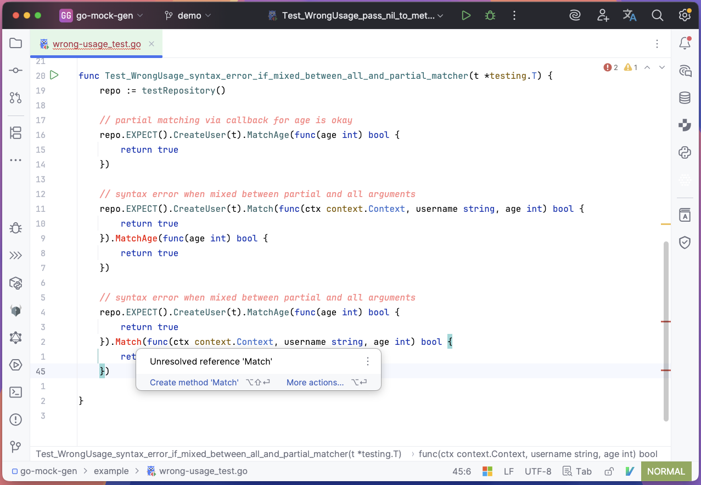
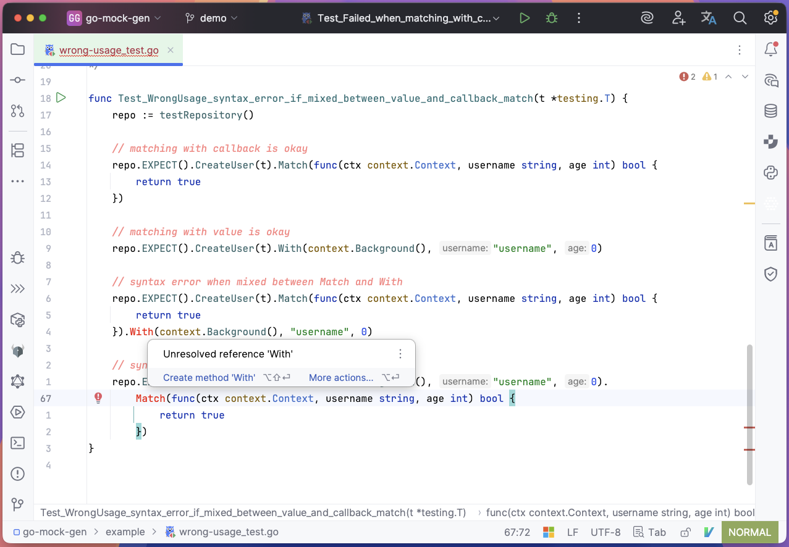
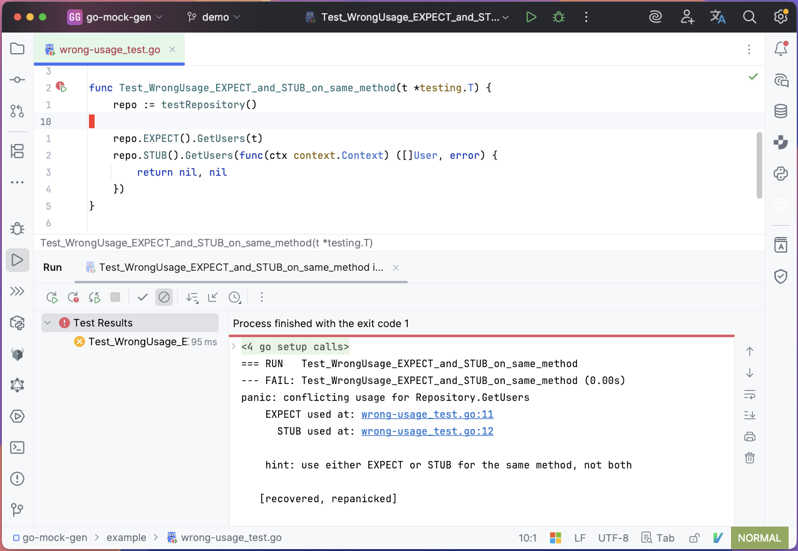
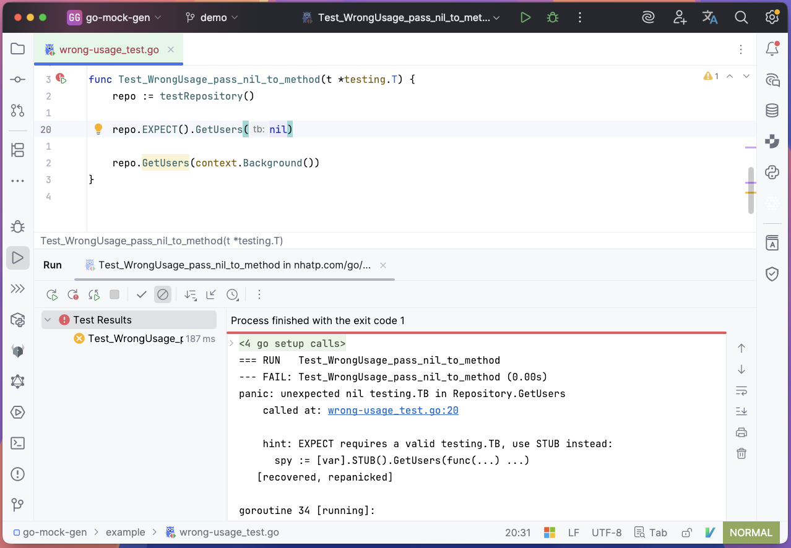
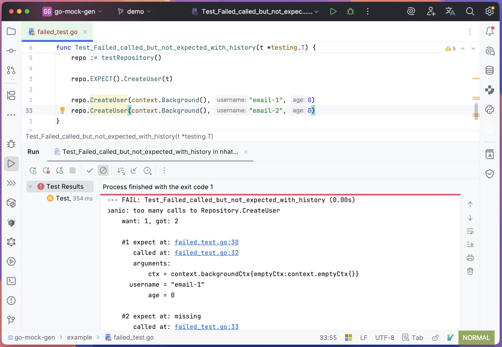
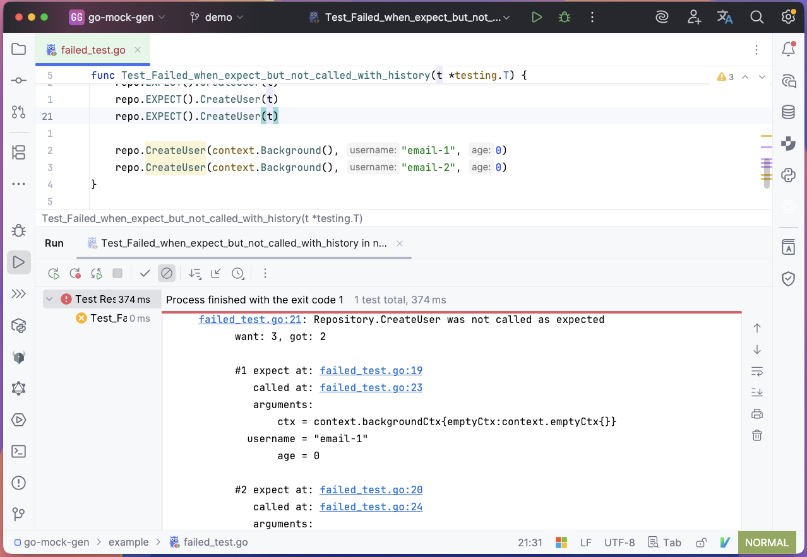
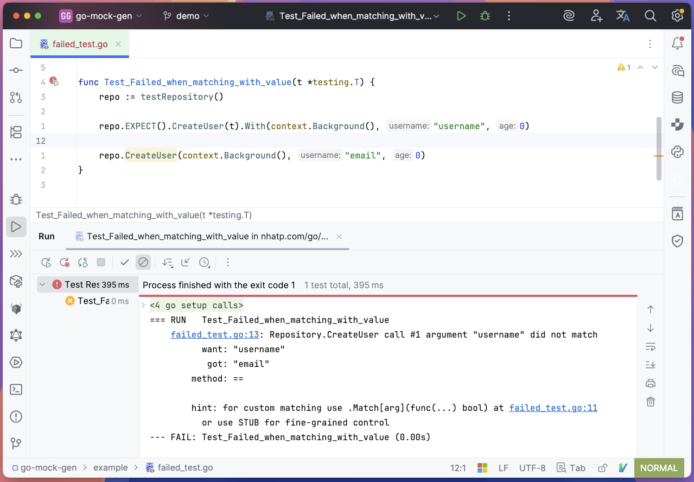
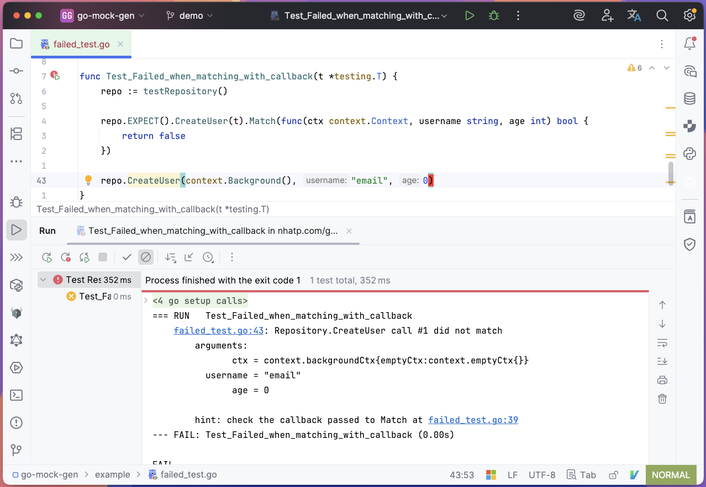

# go-mock-gen


`go-mock-gen` is a tool to generate
a [type-safe](#Screenshots), [minimal](#API), [zero-dependency](example/mockgen_test.go)
and [idiomatic](example/mockgen_example_test.go) mock for testing with a strong focus on Developer Experience. There
are no `any`, no magic matchers. The API is designed so you can't do anything wrong - and when you do, it tells you
exactly why, where, and how to fix it.


<p align="center"><a href="https://nhatp.com/go/mock-gen/demo/index.html"></a></p>


## Quick Usage

You can run the command to generate directly via `go run`.

~~~bash
go run nhatp.com/go/mock-gen/cmd/go-mock-gen -i Interface -o mock_interface_test.go
~~~

To install the `go-mock-gen` command, run

~~~bash
go install nhatp.com/go/mock-gen/cmd/go-mock-gen
~~~

options

~~~bash
> go-mock-gen --help
Usage: go-mock-gen [--interface NAME] [--struct STRUCT] [--package PKG_NAME] [--output PATH] [--dry-run] [--example] [--omit-expect] [--no-color] <command> [<args>]

Options:
  --interface NAME, -i NAME
                         comma-separated list of interfaces to mock (e.g. Repository,UserService)
  --struct STRUCT, -s STRUCT
                         struct name for the generated mock; only valid when mocking a single interface;
                         defaults to the unexported interface name (e.g. Repository -> repository)
  --package PKG_NAME, -p PKG_NAME
                         package name for the generated code. Defaults to the source package name of the interface
  --output PATH, -o PATH
                         output file for the generated code [default: mockgen_test.go]
  --dry-run, -d          preview changes without writing to disk [default: false]
  --example              emit test examples [default: false]
  --omit-expect          omit EXPECT mock generation [default: false]
  --no-color             disable colors [default: false]
  --help, -h             display this help and exit

Commands:
  version                Print version information and exit

Examples:
  Generate mocks for a single interface:
    go-mock-gen -i Repository

  Generate mocks for a single interface with example tests:
    go-mock-gen -i Repository --example

  Generate mocks for multiple interfaces:
    go-mock-gen -i Repository,UserService

  Generate a mock with a custom struct name:
    go-mock-gen -i Repository -s repoMock

  Generate with a custom package and output file:
    go-mock-gen -i Repository -p mocks -o mocks/mockgen_test.go
~~~

---

## API

There are two API categories:

- The `.EXPECT()` way is for convenience.
- The `.STUB()` way is for fine-grained control.

On the same method, you cannot mix between them, otherwise the test will fail immediately.

### .EXPECT()

There are only 10 ways to set an expectation - no Once(), no Twice(), no Times(). If you want to expect 2 calls, just
use EXPECT twice.

| after `.EXPECT().Method(t)`           | Arguments         | Return | Usage                         |
|---------------------------------------|-------------------|--------|-------------------------------|
| `<empty>`                             | -                 | zero   | expect the call, ignore args  |
| `.Return(…)`                          | -                 | …      | ignore args                   |
| `.With(…)`                            | all, value        | zero   | match all args by value       |
| `.With(…).Return(…)`                  | all, value        | …      | match all args by value       |
| `.With[Arg](…)`                       | partial, value    | zero   | match argument(s) by value    |
| `.With[Arg](…).Return(…)`             | partial, value    | …      | match argument(s) by value    |
| `.Match(func(…) bool)`                | all, callback     | zero   | match all args by callback    |
| `.Match(func(…) bool).Return(…)`      | all, callback     | …      | match all args by callback    |
| `.Match[Arg](func(…) bool)`           | partial, callback | zero   | match argument(s) by callback |
| `.Match[Arg](func(…) bool).Return(…)` | partial, callback | …      | match argument(s) by callback |

If you use it in a wrong way the IDE will show you the error. In case it is not a syntax error the test will fail and
show you exactly why.

Quick example:
```go
package test

import "testing"

func Test_Quick_Expect_Example(t *testing.T) {
	repo := testRepository()

	t.Run("expect one call - ignore args - return zero", func(t *testing.T) {
		repo.EXPECT().GetUsers(t)
		// ...
		repo.GetUsers(...)
	})

	t.Run("expect two calls - first call match arg - second call stub return", func(t *testing.T) {
		repo.EXPECT().GetUsers(t).With(...)
		repo.EXPECT().GetUsers(t).Return(...)
		// ...
		repo.GetUsers(...)
		out := repo.GetUsers(...)
	})
}

```

### .STUB()

The STUB API is even simpler than EXPECT. You need to provide a function with the same signature as the
implementation, and it returns a spy for you to assert yourself:

```go
package test

import (
	"fmt"
	"testing"
)

func Test_STUB(t *testing.T) {
	repo := testRepository()

	spy := repo.STUB().GetUsers(func(input string) []string {
		// inspect calls yourself
		if input != "awesome" {
			t.Fatal("hey, be awesome")
		}
		return nil
	})

	// ...test code...

	// inspect calls yourself
	if len(spy.Calls) != 1 {
		t.Fatal("why didn't you call me?")
	}

	if spy.Calls[0].Arguments.Input == "awesome" {
		fmt.Println("good!")
	}
}
```

---

## Screenshots


*You cannot mix between matching all arguments or partial argument(s), enforced at the syntax level*


*You cannot mix between argument via value or a callback, enforced at the syntax level*


*You cannot use .EXPECT() and .STUB() on the same method*


*When nil is passed where it is not expected, go-mock-gen tells you why and where*


*Error message when a call is not expected with full history*


*Error message when expected but not called with full history*


*Error message when expected argument by value fails*


*Error message when match argument callback returns false*


<p align="center"><a href="https://nhatp.com/go/mock-gen/demo/index.html"></a></p>


### Contributing & License

PRs are welcome! See the [CONTRIBUTING](CONTRIBUTING.md). Distributed under the Apache License 2.0.

If you like the project, feel free to [buy me a coffee](https://buymeacoffee.com/toniphan21). Thank you!
